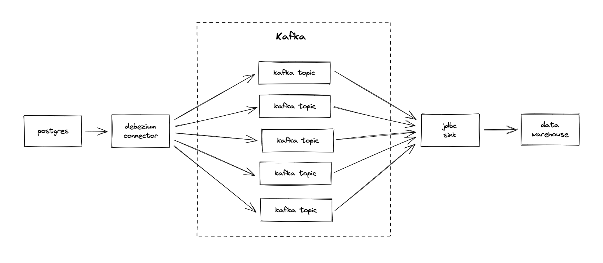

This is a proof of concept of how to replicate a Postgres database to X, where X can be any data warehouse that supports JDBC connection.

## Usage

Start entire stack:

```sh
docker compose up --build
```

Wait for Kafka to be ready, then create source and sink:

```sh
curl -i -X POST -H "Accept:application/json" -H  "Content-Type:application/json" http://localhost:8083/connectors/ -d @source.json
curl -i -X POST -H "Accept:application/json" -H  "Content-Type:application/json" http://localhost:8083/connectors/ -d @sink.json
```

You can see connectors in http://localhost:8080/ui/clusters/local/connectors.

Check that tables are replicated in target database:

```
psql -h 127.0.0.1 -p 5433 -d inventory -U postgres
...
inventory=# select * from customers;
  id  | first_name | last_name |         email
------+------------+-----------+-----------------------
 1001 | Sally      | Thomas    | sally.thomas@acme.com
 1002 | George     | Bailey    | gbailey@foobar.com
 1003 | Edward     | Walker    | ed@walker.com
 1004 | Anne       | Kretchmar | annek@noanswer.org
```

Try inserting rows in source database:

```
psql -h 127.0.0.1 -p 5432 -d inventory -U postgres
...
inventory=# insert into inventory.customers values (1005, 'John', 'Doe', 'john@doe.com');
INSERT 0 1
```

Or update existing rows in source database:

```
psql -h 127.0.0.1 -p 5432 -d inventory -U postgres
...
inventory=# update inventory.customers set email = 'foo@bar.com' where id = 1005;
UPDATE 1
```

## How does it work?



- Postgres CDC via debezium connector using logical replication
- Each table is replicated to a topic
- Schema is managed via schema registry
- JDBC sink then consumes the topics and inserts to the target data warehouse
